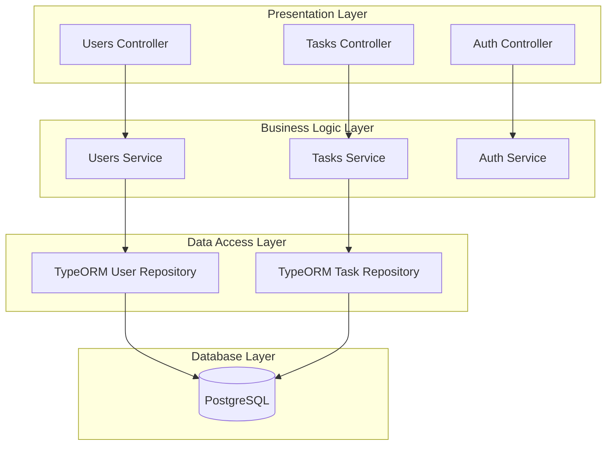

# Task Manager Backend: Architecture

## Framework

NestJS

## Database

PostgreSQL

## ORM

TypeORM

## Authentication

JWT (JSON Web Tokens)

## System Architecture

## Module Structure

- **Users Module:** User profile management (view and update profile)
- **Tasks Module:** Task CRUD operations, filtering, and search
- **Auth Module:** Authentication and authorization (signup, signin, JWT validation)

## Database

- **Type:** PostgreSQL
- **Entities:** User, Task

## Authentication & Authorization

- JWT token-based authentication
- Public endpoints: POST /signup, POST /signin
- Protected endpoints: All other endpoints require JWT authentication
- Ownership verification: Users can only access their own resources

## Global Patterns

- RESTful API design
- Consistent error response format
- Input validation on all endpoints
- Password hashing and exclusion from responses
- Timestamp fields (createdAt, updatedAt) on all entities
- Ownership-based access control

