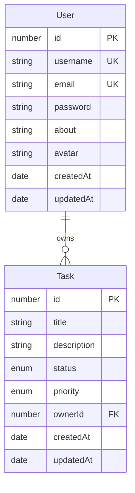

# Task Manager Backend: Domain Models

## Entity-Relationship Diagram

## User Entity

**Entity Name:** User

### Fields

- **id:** number, Primary key, auto-generated, required
- **username:** string, required, unique, 2-30 characters, alphanumeric and underscores only
- **email:** string, required, unique, valid email format
- **password:** string, required, minimum 6 characters, hashed in storage
- **about:** string, optional, nullable, 2-200 characters
- **avatar:** string, optional, nullable, valid URL format
- **createdAt:** Date, auto-generated, required
- **updatedAt:** Date, auto-generated, required

### Relationships

- One-to-Many with Task (User owns many Tasks)

### Immutability

- Username cannot be changed after registration
- Email cannot be changed after registration

## Task Entity

**Entity Name:** Task

### Fields

- **id:** number, Primary key, auto-generated, required
- **title:** string, required, 1-250 characters
- **description:** string, optional, nullable, 1-1024 characters
- **status:** enum, required, values: "todo" | "in-progress" | "done", default: "todo"
- **priority:** enum, required, values: "low" | "medium" | "high", default: "medium"
- **ownerId:** number, required, foreign key to User.id
- **createdAt:** Date, auto-generated, required
- **updatedAt:** Date, auto-generated, required

### Relationships

- Many-to-One with User (Task belongs to User via ownerId)

### Immutability

- ownerId cannot be changed after creation

