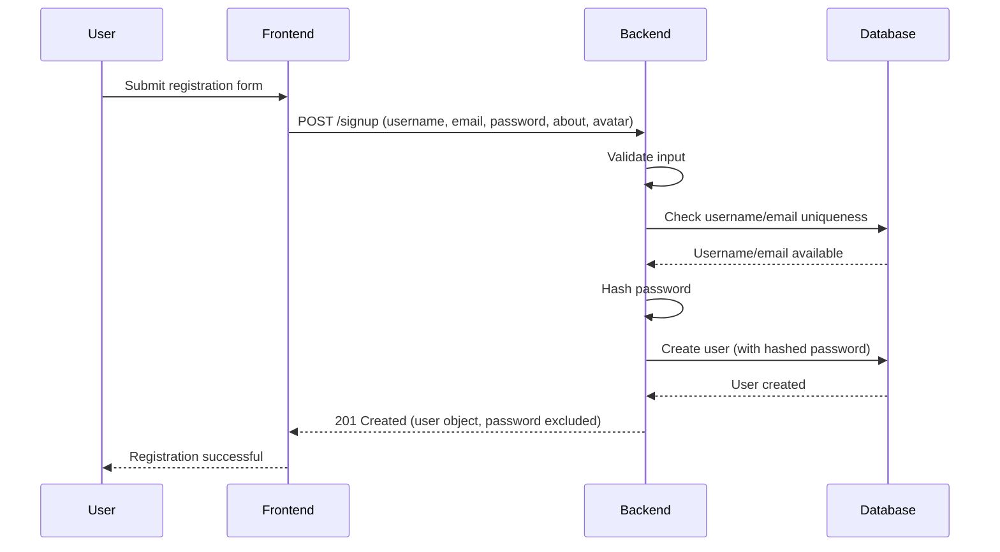
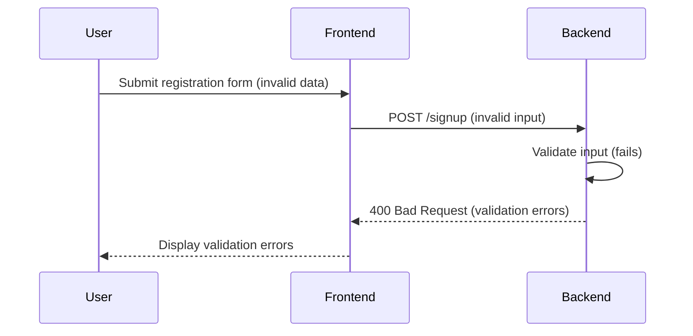
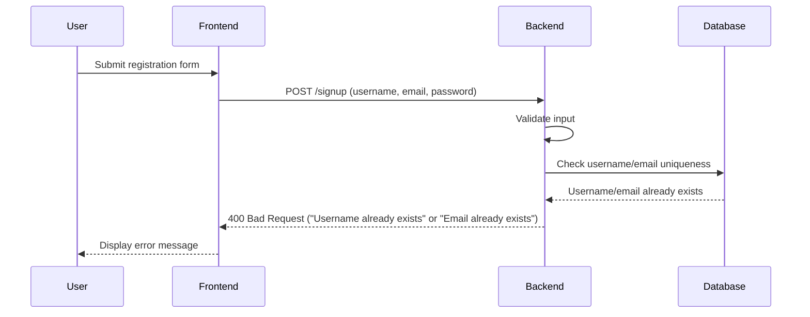
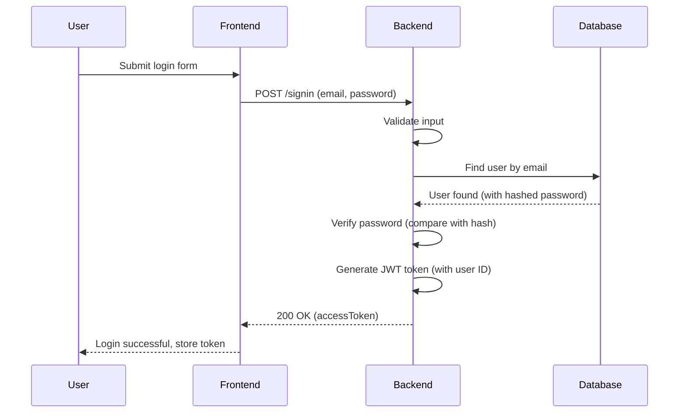
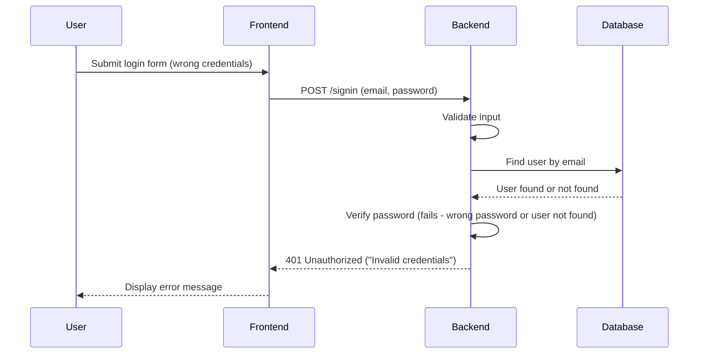
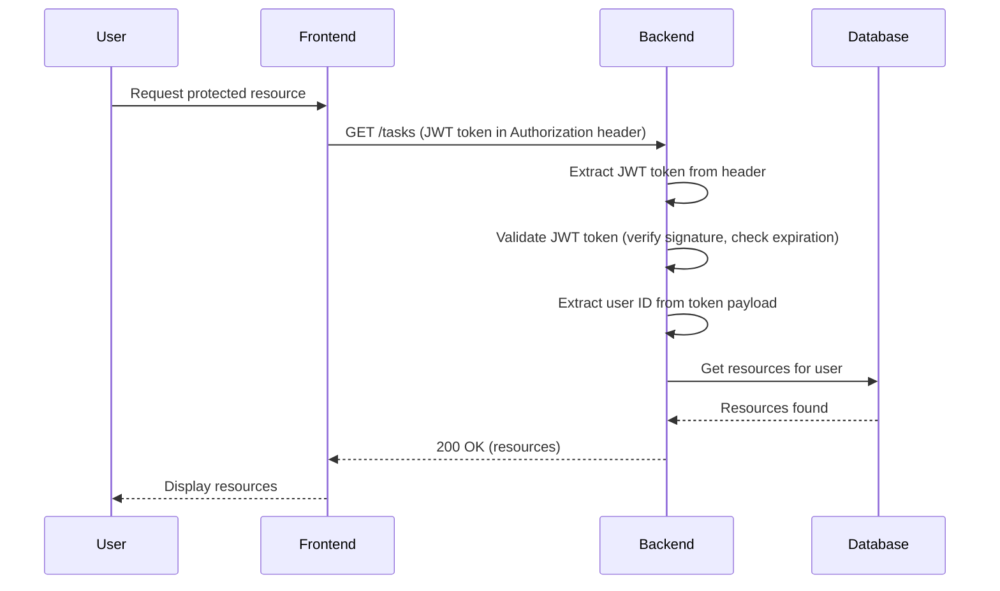
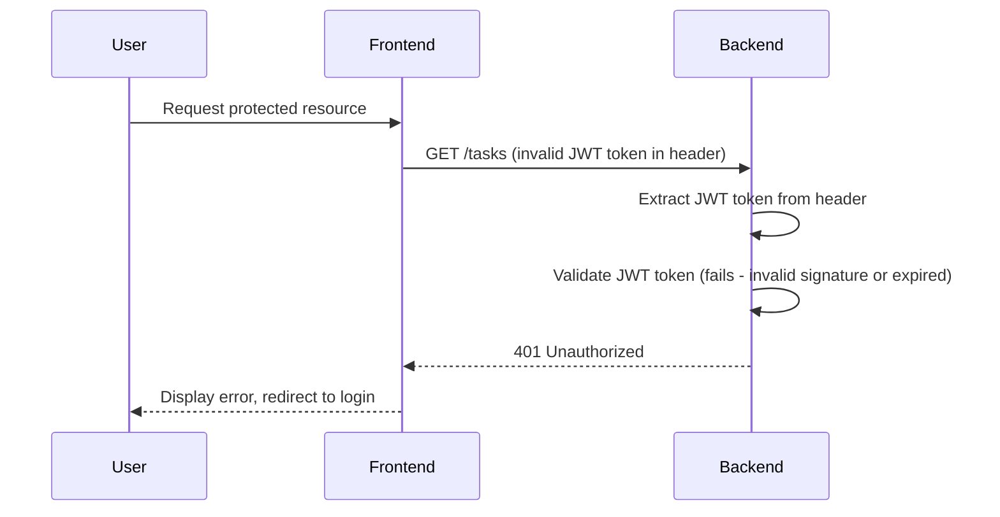
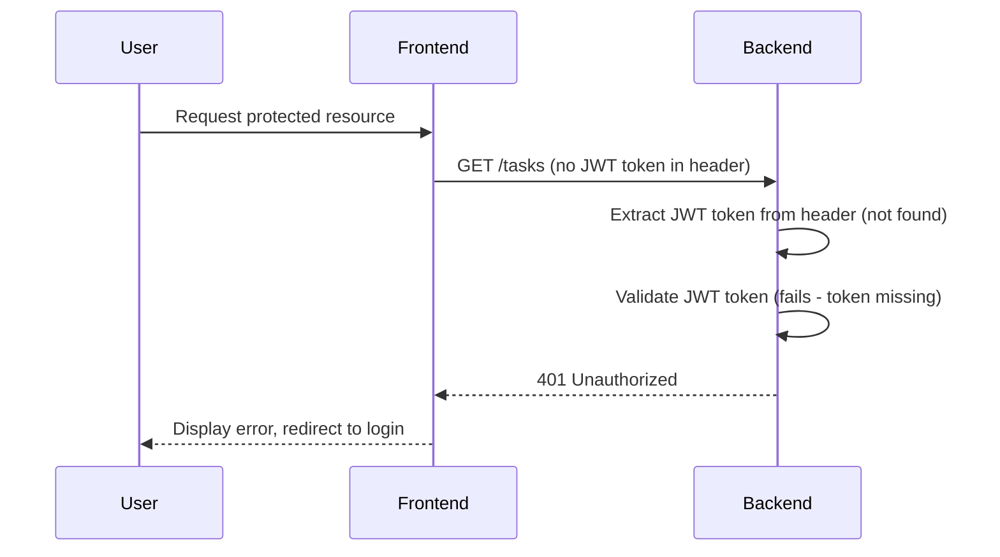

# Task Manager Backend: Authentication API Flows

## Registration Flow (Success)

## Registration Flow (Validation Error)

## Registration Flow (Duplicate Username/Email)

## Login Flow (Success)

## Login Flow (Invalid Credentials)

## Protected Endpoint Flow (Valid Token)

## Protected Endpoint Flow (Invalid Token)

## Protected Endpoint Flow (Missing Token)

