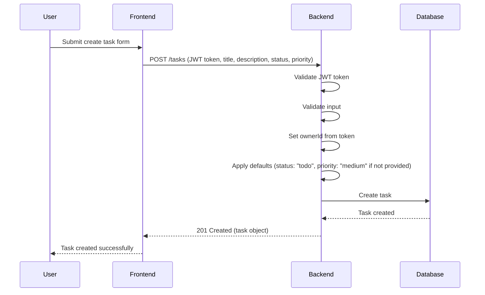
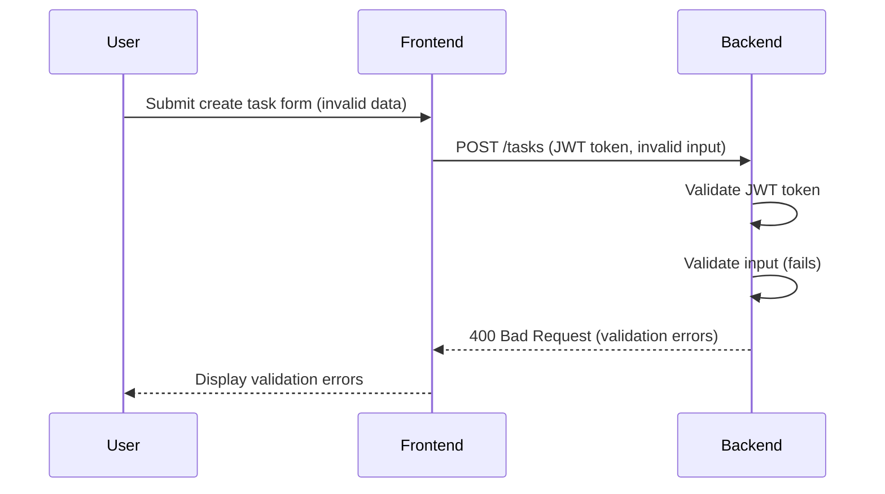
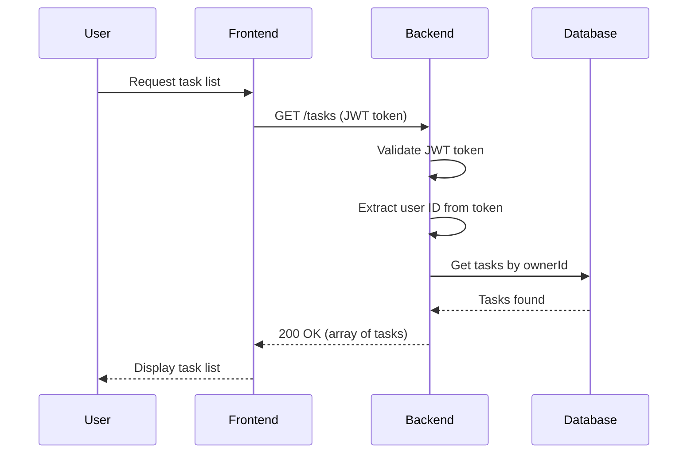
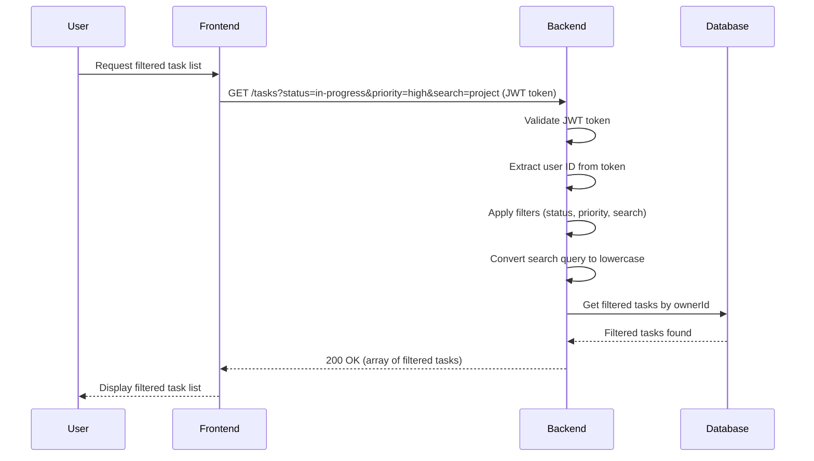
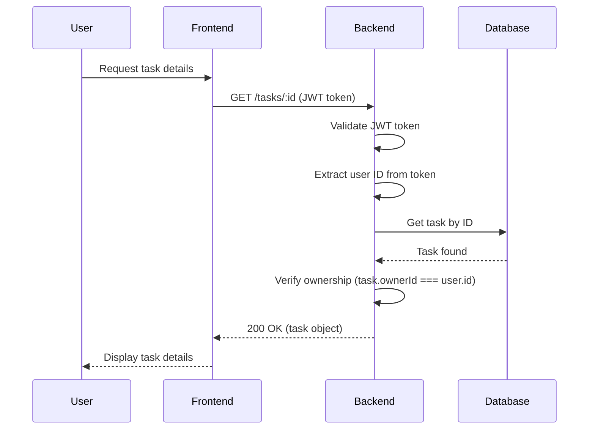
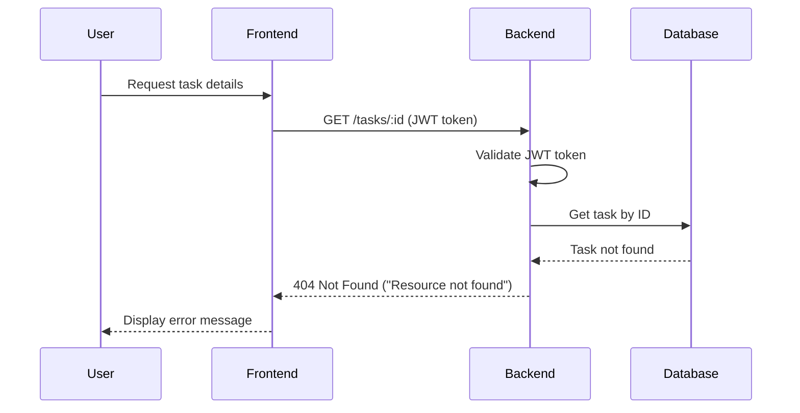
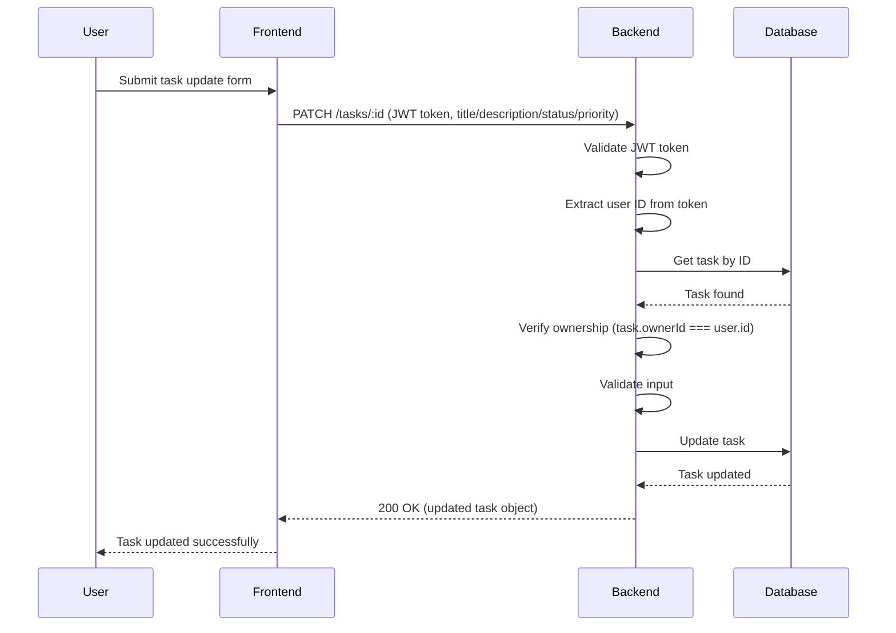
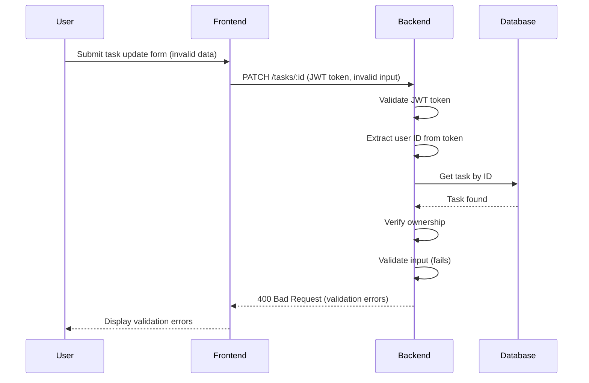
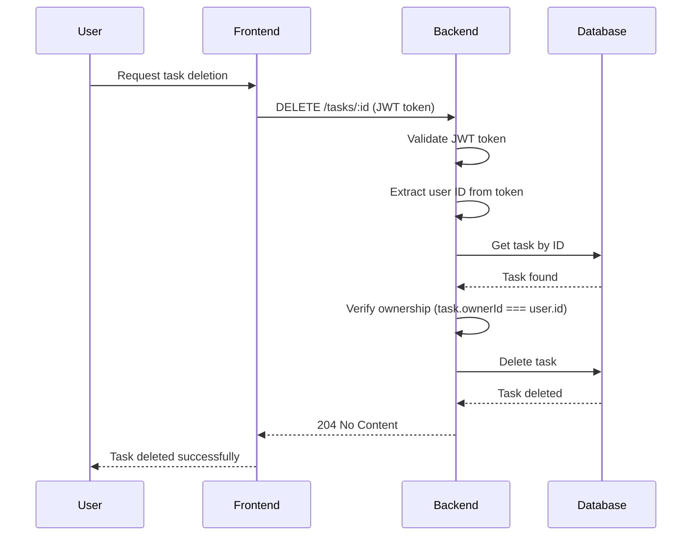
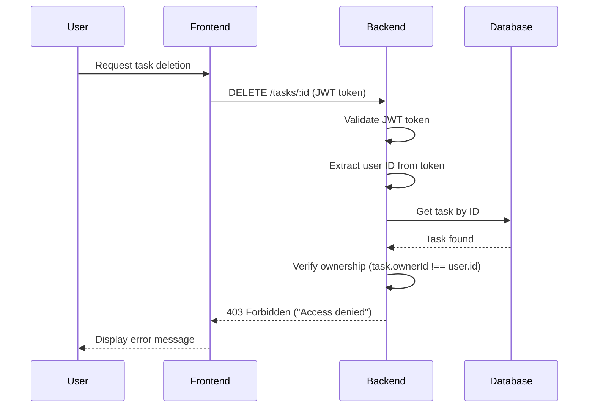

# Task Manager Backend: Task Management API Flows

## Create Task Flow (Success)

## Create Task Flow (Validation Error)

## List Tasks Flow (Success)

## List Tasks Flow (With Filters)

## Get Task Flow (Success)

## Get Task Flow (Ownership Violation)

## Get Task Flow (Not Found)

## Update Task Flow (Success)

## Update Task Flow (Validation Error)

## Delete Task Flow (Success)

## Delete Task Flow (Ownership Violation)

