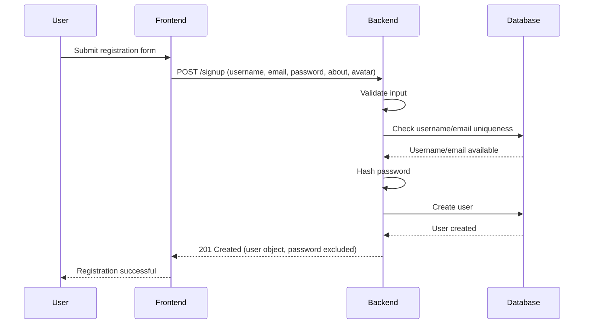
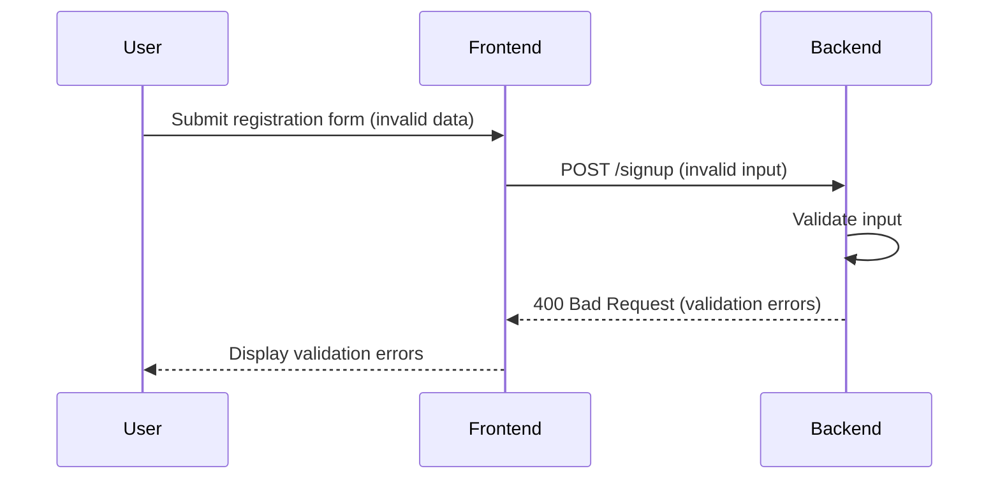
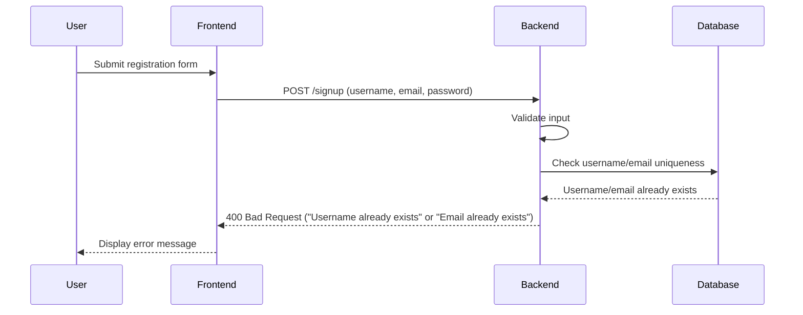
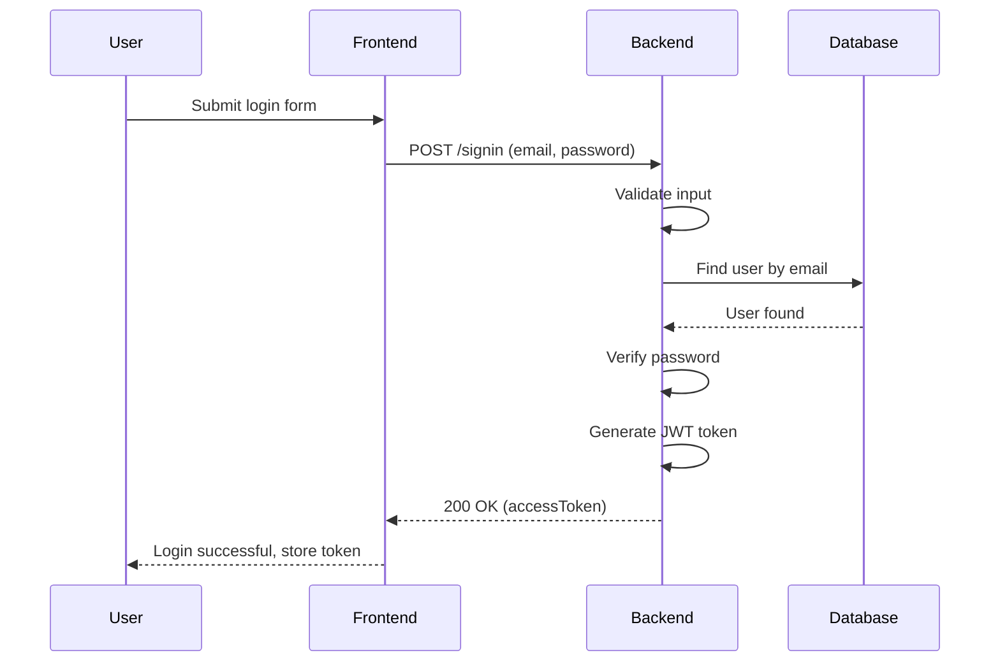
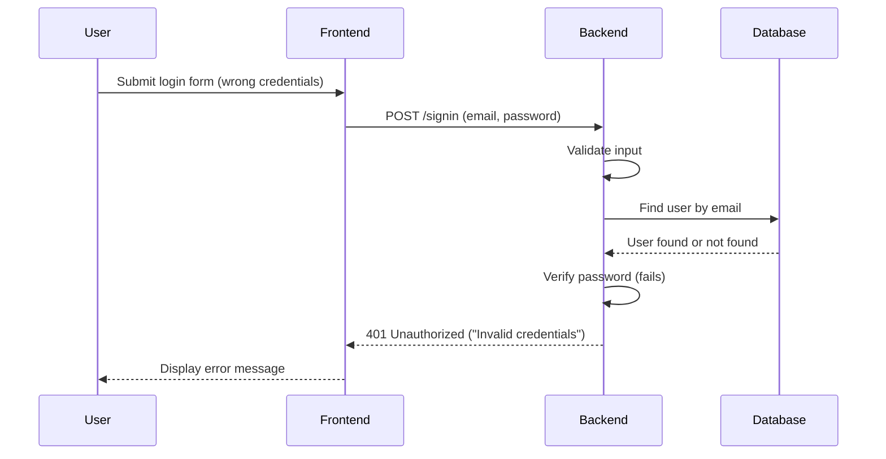
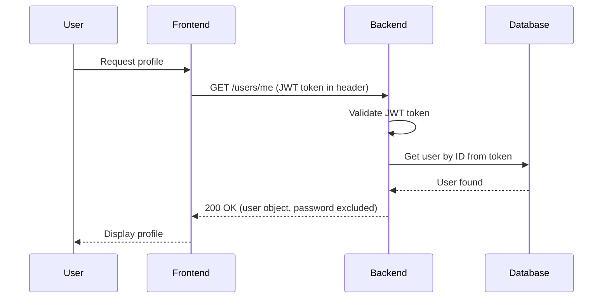
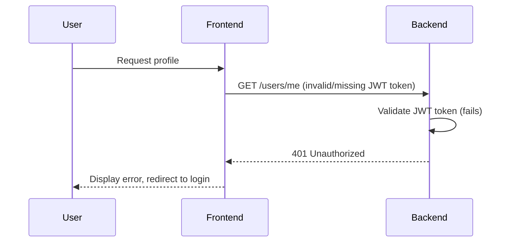
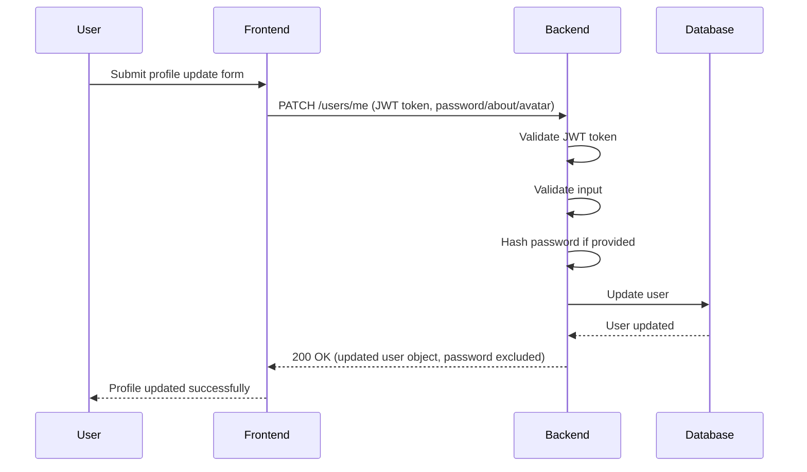
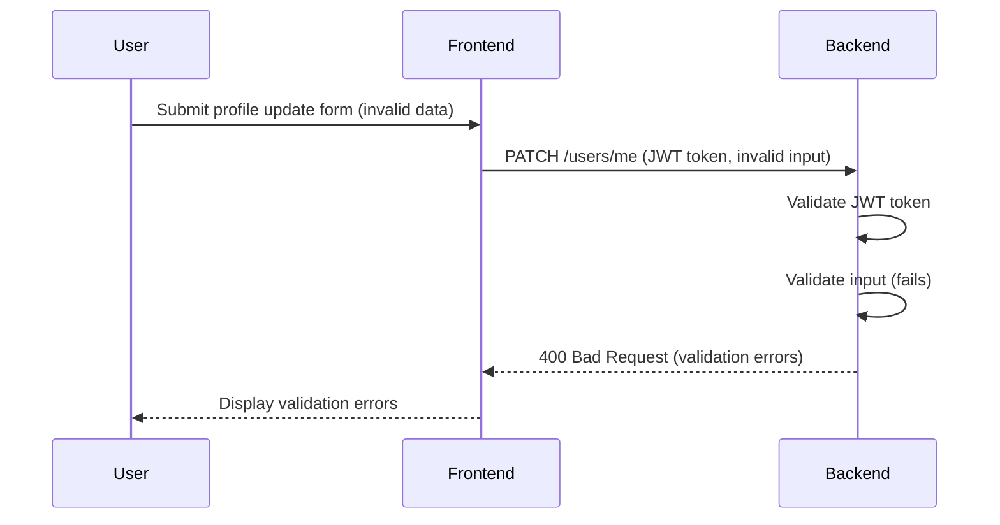

# Task Manager Backend: User Management API Flows

## User Registration Flow (Success)

## User Registration Flow (Validation Error)

## User Registration Flow (Duplicate Username/Email)

## User Login Flow (Success)

## User Login Flow (Invalid Credentials)

## Get Profile Flow (Success)

## Get Profile Flow (Invalid Token)

## Update Profile Flow (Success)

## Update Profile Flow (Validation Error)

